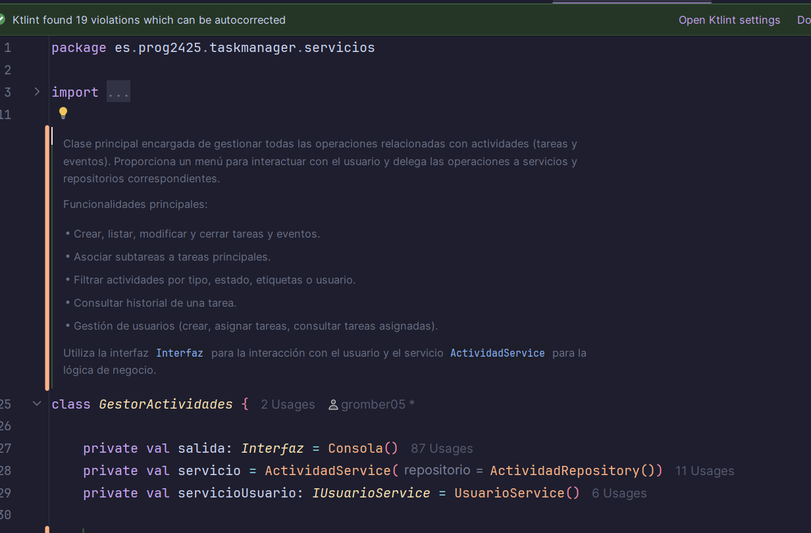

# 4.4.1 Dokka || Gonzalo Romero Bernal 1DAM

## Introducción

Este informe describe paso a paso como se ha realizado la instalación, configuración y generación de documentación del código utilizando Dokka, así como capturas de pantalla del proceso y de la documentación generada en HTML.

---

## ¿Cómo he realizado el proceso?

### 1. Instalación del Plugin

Se ha integrado dentro del archivo `build.gradle.kts` del proyecto para añadir el plugin Dokka:

```kotlin
plugins {
    id("org.jetbrains.dokka") version "1.9.20"
}
```

### 2. Configuración de Dokka (Opcional)

De manera opcional, se puede agregar la siguiente configuración para personalizar la generación automática de la documentación:

```kotlin
tasks.dokkaHtml {
    outputDirectory.set(buildDir.resolve("dokka"))
    dokkaSourceSets {
        configureEach {
            includeNonPublic.set(false)
            skipDeprecated.set(true)
            reportUndocumented.set(true)
        }
    }
}
```

### 3. Documentación del código con KDOC

Se añadieron comentarios KDoc a las clases y métodos principales, por ejemplo:

```kotlin
/**
 * Servicio encargado de gestionar las operaciones relacionadas con usuarios.
 */
class UsuarioService { ... }
```

### 4. Generación de la documentación

Se ejecutó el siguiente comando en la terminal para generar la documentación HTML:

```bash
./gradlew dokkaHtml
```

### 5. Revisión del Resultado

Al finalizar el proceso, la documentación se generó en la carpeta `build/dokka`. Se abrió el archivo `index.html` en el navegador para verificar la documentación.

---

## Capturas de Pantalla

### 1. Plugin en `build.gradle.kts`


### 2. Ejemplo de comentario dentro del archivo en formato KDOC


### 3. Ejecutando el comando en la terminal


### 4. Documentación generada automaticamente (index.html)


---

## Conclusión

Dokka es una herramienta bastante útil y profesional que permite la generación de código automático a partir del código que tengas ya comentado dentro de los archivos Kotlin. Esto permite mantener toda la documentación visible y al alcance de cualquier programador, ahorrando tiempo a la hora de crear la documentación.
