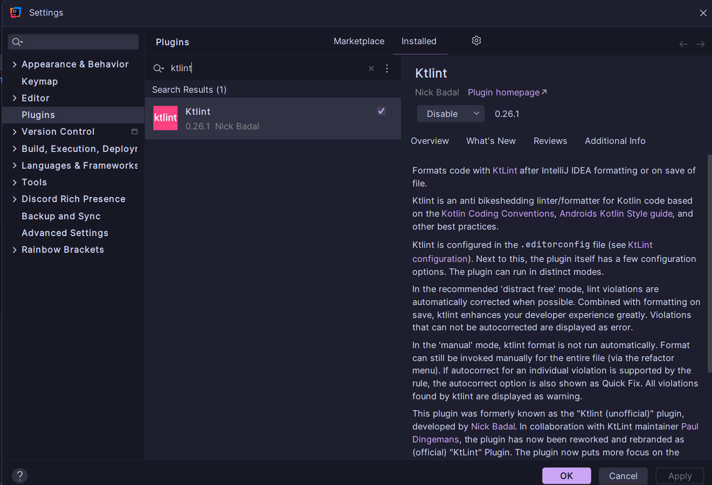
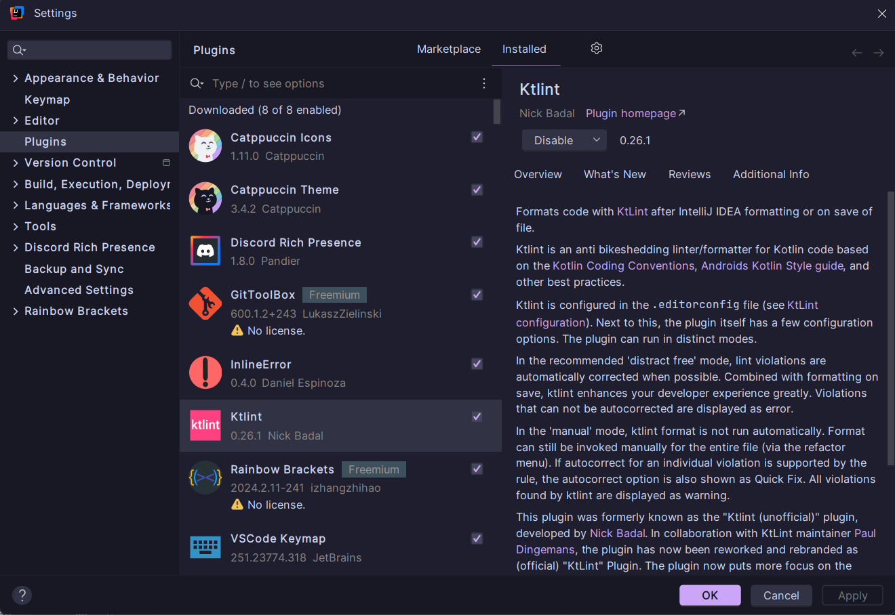

# EDES-4.3.1 - Analizador de código estático (Ktlint)

## 1. Proceso de instalación y puesta en marcha

La instalación de Ktlint ha sido sencilla. Desde el marketplace de plugins de IntelliJ IDEA busqué "Ktlint" y lo instalé, quedando operativo inmediatamente sobre mi código.

  
*Captura: Ktlint encontrado en el marketplace de plugins de IntelliJ.*

  
*Captura: Ktlint funcionando e identificando errores en el proyecto.*

Como alternativa, también es posible integrarlo mediante Gradle con:

```gradle
plugins {
    id("org.jlleitschuh.gradle.ktlint") version "12.1.0"
}
```

y ejecutar el chequeo de formato con:

```sh
./gradlew ktlintCheck
```

---

## 2. Integración y análisis en el proyecto

Ktlint se ha integrado y ejecutado en la rama `feature/linters` del repositorio.

Enlace a la rama:  
[https://github.com/gromber05/kotest/tree/feature/ktlint-linters](https://github.com/gromber05/kotest/tree/feature/ktlint-linters)

---

## 3. Errores detectados, clasificados y solucionados

A continuación se documentan algunos tipos de errores detectados por Ktlint y la solución aplicada, enlazando a los commits relevantes:

### 1. Importaciones no utilizadas

Ktlint señala imports que no están en uso. Para solucionar este error, se eliminaron las líneas de import innecesarias en los archivos afectados.

```kotlin
import es.prog2425.taskmanager.modelo.Usuario
import java.util.Random // <- Importación no utilizada

class UsuarioRepository : IUsuarioRepository {
    // ...
}
```

---

### 2. Funciones declaradas pero nunca utilizadas

Detección de funciones privadas que no se utilizan dentro de mi código (código muerto). Eliminé las funciones que no se usaban en ningún lugar del proyecto.

```kotlin
private fun calcularHash(usuario: Usuario): Int {
    // ...
}
```

---

### 3. Uso de println en vez de sistema de salida centralizado


Se detectó el uso de `println` en vez de la función de salida estándar del proyecto. Cambié las llamadas a las funciones de `println` por `salida.mostrar()`.

- Antes: 
```kotlin
println("Usuario creado correctamente")
```
- Después:
```kotlin
salida.mostrar("Usuario creado correctamente")
```

---

### 4. Espacios en blanco innecesarios o líneas demasiado largas


Ktlint me sugirió que había líneas con espacios finales o líneas que excedían el límite de longitud estándar. Eliminé espacios extra y adapté las líneas para cumplir las buenas prácticas.

```kotlin
val nombre = "Juan"    
val apellido = "Pérez" // Línea muy larga que excede el límite recomendado por Ktlint
```

---

### 5. Nombres de funciones y variables poco descriptivos


Ktlint me sugirió cambiar los nombres de funciones para hacerlos más descriptivos y específicos. Renombré funciones y variables siguiendo las buenas prácticas de Kotlin.

- Antes: 
```kotlin
fun f1() { /* ... */ }
val x = 10
```

- Después:
```kotlin
fun calcularEdadUsuario() { /* ... */ }
val edadUsuario = 10
```

---

## 4. Configuración personalizada de Ktlint

Ktlint permite configurarse a través del archivo `.editorconfig`. Por ejemplo, para permitir archivos sin salto de línea:

```ini
[*.kt]
insert_final_newline = false
```

Antes, Ktlint daba error si no había salto de línea. Tras la modificación, ya no da error.

---

## 5. Preguntas

### [1]

#### 1.a ¿Qué herramienta has usado y para qué sirve?

He usado **Ktlint**, un formateador y analizador de código para Kotlin que ayuda a mantener un estilo y formato uniforme en el código.

#### 1.b ¿Cuáles son sus características principales?

- Aplicación automática de formato.
- Detección y corrección de errores de estilo.
- Integración con IDE.
- Es configurable a través del archivo `.editorconfig`

#### 1.c ¿Qué beneficios obtengo al utilizar dicha herramienta?

- Código más limpio y legible.
- Facilita las revisiones y el mantenimiento.

---

### [2]

#### 2.a ¿Cuál error te ha parecido que ha mejorado más tu código?

La detección de nombres poco descriptivos en funciones, ya que ahora el código es más fácil de entender y buscar.

#### 2.b ¿La solución que se le ha dado al error/problema la has entendido y te ha parecido correcta?

Sí, las sugerencias han sido claras y he podido aplicar los cambios fácilmente.

#### 2.c ¿Por qué se ha producido ese error/problema?

Por falta de atención al nombrar funciones durante el desarrollo inicial, porque estuve realizando el código sin pararme a pensar sobre como nombrar a las funciones debidamente

---

### [3]

#### 3.a ¿Qué posibilidades de configuración tiene la herramienta?

Permite personalizar reglas de formato, longitud de línea, espacios, indentación, salto de línea final, etc., mediante `.editorconfig` o ajustes en el plugin.

#### 3.b ¿Cuál has cambiado respecto a la configuración por defecto?

He cambiado la regla de salto de línea final (`insert_final_newline = false`) y el modo de ejecución a manual.

#### 3.c Ejemplo del impacto

- **Antes:**  
  [Código original](https://github.com/gromber05/kotest/blob/0cdc4cbd909930a95d0adef5e326a5ac95583e22/src/main/kotlin/utils/Utilidades.kt#L15-L33)
- **Después:**  
  [Código tras aplicar Ktlint](https://github.com/gromber05/kotest/blob/2b9daaaceedd393ac82275bdae93572963f34a34/src/main/kotlin/utils/Utilidades.kt#L7-L30)

---

### [4]

#### 4. ¿Qué conclusiones sacas después del uso de estas herramientas?

Ktlint ha mejorado la calidad de mi código, pero no sustituye la revisión humana ni la comprensión lógica, simplemente ayuda a mantener el código ordenado y profesional.

---