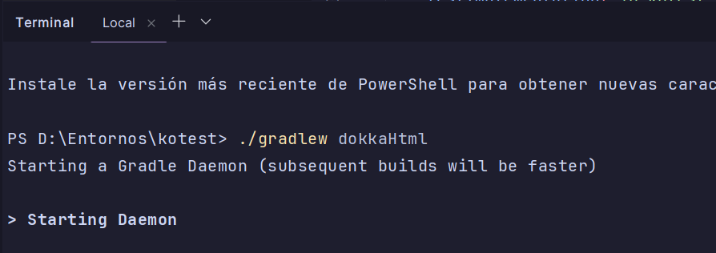
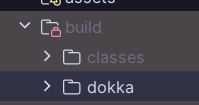
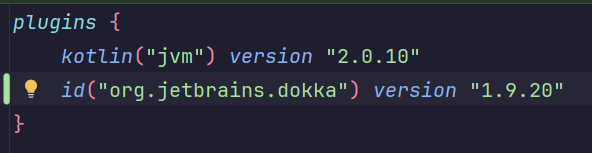
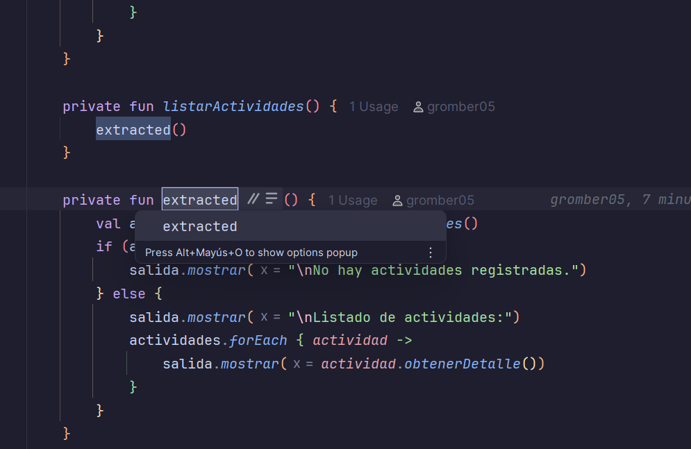
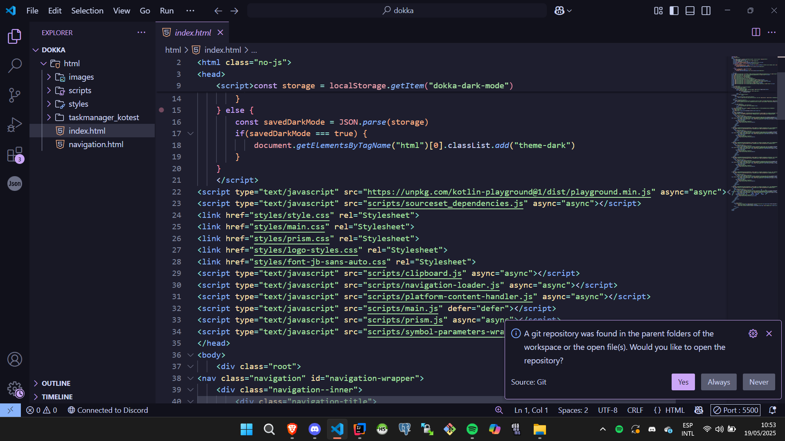

# Code Smell y Refactorización

## [1]

### 1.a ¿Qué code smell y patrones de refactorización has aplicado?
Durante el análisis de código con el detector propio del IDE IntelliJ Idea, he encontrado diferentes problemas de diseño y estilo. Para ello he hecho uso de distintas formas de corregir dichos problemas siguiendo los patrones de refactorización. 

He encontrado en varias partes el Método Largo (Long Method) que consiste en un método que contiene muchas líneas de código completamente innecesarias. Lo solucioné dividiendo todo esto en funciones más pequeñas, y saqué el código que se repetía a una función común.

También he encontrado nombres poco descriptivos e inconsistentes. Lo he solucionado refactorizando el código y renombrando dichas funciones a unas un poco más descriptivas.

### 1.b Teniendo en cuenta aquella funcionalidad que tiene pruebas unitarias, selecciona un patrón de refactorización de los que has aplicado y que están cubiertos por los test unitarios. ¿Por qué mejora o no mejora tu código? Asegúrate de poner enlaces a tu código

En la clase [GestorActividades.kt](src/main/kotlin/servicios/GestorActividades.kt) ví que el método menu() era muy largo y contenía demasiada lógica dentro de un solo bloque de código, que dificultaba la lectura del código. Para mejorar la estructura y solventar el problema que había encontrado, apliqué el patrón de refactorización de Extract Method separando partes del menú en métodos privados algo más compactos, como:

- crearTarea()

- listarActividades()

- asociarSubtarea()

- cambiarEstadoTarea()

- cerrarTarea()

- crearUsuario()

- asignarTareaAUsuario()

Todo esto permitió al método menu() una mayor facilidad a la lectura de otros programadores y más fácil de expandir, ya que delega todas las funciones a funciones que reciben el principio de única responsabilidad.

¿Por qué todo esto mejora el código?

- El código se hace más legible, desencapsulando toda la función que antes estaba dentro del método menú, estando ahora fuera de este.
- El código ahora se hace más mantenible, es decir, se puede modificar o extender el comportamiento de una opción del menú es más sencillo, ya que está aislado
- Algunos métodos pueden volver a ser llamados en otra parte del código.

- Código después de la refactorización.
  https://github.com/gromber05/kotest/blob/9c129fbb9af03cf1087bfbd82c749f3f6ad4555b/src/main/kotlin/servicios/GestorActividades.kt#L12-L358
- Código antes de la refactorización.
  https://github.com/gromber05/kotest/blob/b6aa51545d7170b43aec948ffc2fc63a71f024ac/src/main/kotlin/servicios/GestorActividades.kt#L11-L393

## [2]

### 2.a Describe el proceso que sigues para asegurarte que la refactorización no afecta a código que ya tenías desarrollado.

1. Primero me aseguro de que tengo pruebas unitarias que cubran las funcionalidades que ya existen y que me validan que el comportamiento que yo espero de los métodos se cumpla. Ejecuto todas las pruebas para comprobar que todo funciona correctamente.
2. Realizo la refactorización por etapas, como si de un deploy de una actualización de una aplicación se tratase. De esta manera, me aseguro que todo se realiza de una manera controlada.
3. Vuelvo a ejecutar todas las pruebas unitarias para comprobar que todo está en correcto funcionamiento. Si esto es verdadero, puedo continuar, pero si no realizan el comportamiento esperado, puedo volver a la función que está dando fallos para realizar un rollback

También cabe destacar que todo esto se debería de realizar en conjunto con un control de versiones para tener registros del código original y el refactorizado en todo momento.

## [3]

### 3.a ¿Qué funcionalidad del IDE has usado para aplicar la refactorización seleccionada? Si es necesario, añade capturas de pantalla para identificar la funcionalidad.

Para realizar la refactorización del código he hecho uso de la herramienta de refactorización del código automática que posee el IDE IntelliJ Idea de Jetbrains. Esta funcionalidad que posee este entorno permite realizar cambios estructurales dentro del código de una manera eficiente y bastante segura. De esta manera, nos aseguramos que todas las referencias se actualicen correctamente, minimizando así los errores.

Por ejemplo, para extraer métodos y mejorar la modulabilidad del código, he usado lo siguiente:

- Aquí si seleccionamos el trozo de código que querramos refactorizar se nos debería de abrir un pequeño submenú que nos permite la opción de 'Extract'

- Si seleccionamos la opción de 'extract » function', lo que hace es que nos extrae esa función donde queramos, dentro de la clase, del archivo o a un archivo aparte.

- Esto se realiza para lo mencionado anteriormente, que extrae el método de una función.

Para realizar cambios de nombre, podemos realizar la siguiente función del IDE:

- Dentro del menú de Refactor, seleccionamos la opción de rename

- Y se nos debería de seleccionar como una opción dentro del archivo que nos permite renombrar la función, y se realiza el cambio a nivel global en el proyecto

Para introducir, variables, parámetros, o propiedades dentro de un método, podemos realizarlo de la siguiente manera:

